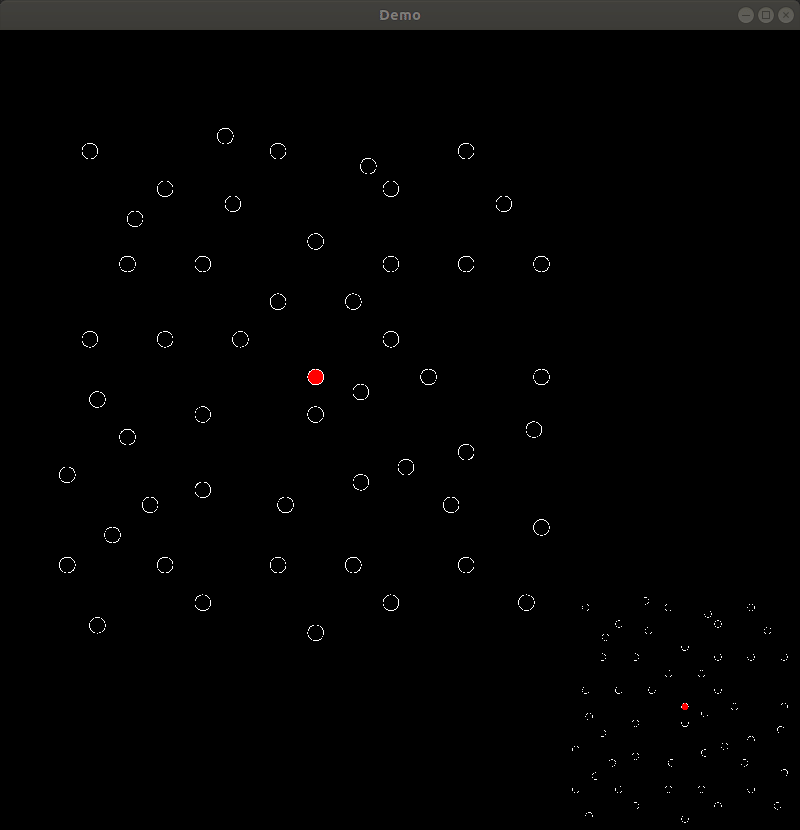

# Simmulated Annealing for VRPTW problem


## Overview
This is implementtion of simmulated annealing metaheuristic for Vehicle Routing Problem with Time Windows ([VRPTW](https://www.hindawi.com/journals/mpe/2012/104279/)).

Simple demonstration how algorithm creates and optimizes initial solution.


Bigger view depicts actual solution, while smaller best solution found so far.

## Build
To build project clone repository with submodules.
```
cd simmulated_annealing
mkdir build
cd build
cmake ..
make
```
To run algorithm without UI
```
./src/annealing_run
```
To run with UI
```
./src/simpleUI_run
```